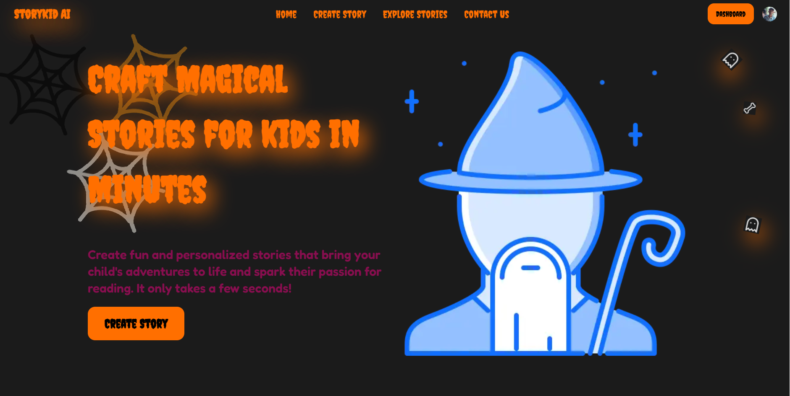

## StoryKidAI

Crea historias usando Inteligencia artificial, usamos IA para crear tus historias por medio de parametros ajustables por el usuario y creamos las imagenes para tus historias usando inteligencia artificial, luego de obtener la historia con las imagenes te permitimos editar las imagenes a su preferencia usando los servicios de cloudinary.

### Tools used:

Libreria de componentes NestUI

- [NextUI](https://nextui.org/)
  ORM drizzle para la coneccion a la base de datos
- [drizzle orm](https://orm.drizzle.team/docs/get-started-postgresql)
- [drizzle](https://orm.drizzle.team/)
  Para la gestion de la base de datos use Neon
  [Neon](https://console.neon.tech/app/projects)
  para la uthenticacion use OAuth con Clerk
- [clerk](https://clerk.com/)

[api generate images free](https://documenter.getpostman.com/view/18679074/2s83zdwReZ#c7e3c6a0-b57d-4d17-ad5a-c4eb8571021f)

